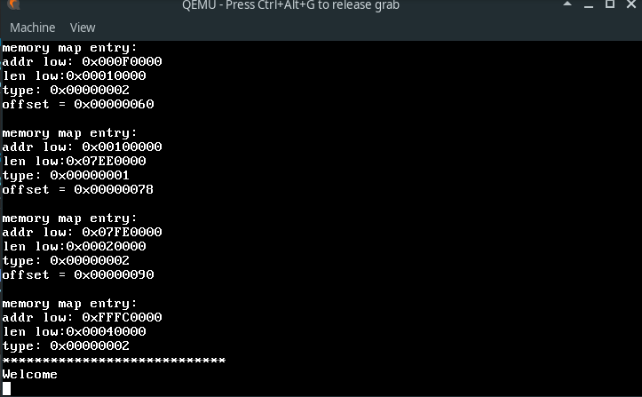

This is a toy kernel I wrote in order to learn about operating system implementation.

##Demo##

## Specifications##
+ Preemptive Round-robin scheduler
+ ATA hard disk driver 
+ FAT32 filesystem support
+ Bitmap phycical memory allocator 
+ Runs ELF position independent executables
+ Support for user mode and system calls

##Build Prerequisites##
A cross compiler , see https://wiki.osdev.org/GCC_Cross-Compiler.  
Once the cross compiler is built, set the CC variable in makefile to the cross compiler path.  

##Build The kernel##
	cd /path/to/source/directory
	make install
	
this should build and copy kernel.elf to the top directory

## Run from command line##
Install qemu emulator, and run:   
`qemu-system-x86_64 -machine pc -kernel kernel.elf [-hda hda.img]`  
where hda.img is a disk image file that the emulator will provide as a hard disk, see [below](#Making-a-partitioned-image-for-testing)  

## Debugging from command line##
	qemu-system-x86_64 -machine pc -kernel kernel.elf -s -S [-hda hda.img]
	#on  another terminal :
	gdb kernel.elf
	set arch i386:x86-64
	target remote localhost:1234 

## Setting up the Project In eclipse##

### 1.  fix compiler errors ###
* project-->properties-->c/c++ build--> untick "generate makefile automatically ; and specify build location
* project-->properties-->c/c++ general--> pre-processor include paths-->providers tab-->check gcc cross builtin , and replace ${COMMAND} with the cross compiler command and ${FLAGS} with the correct flags ,see https://forum.osdev.org/viewtopic.php?f=13&t=29746

### 2.  add run configuration: ###
*  **qemu** : run-->external tools--> add qemu command
*  **qemu-debug**: duplicate the qemu run configuration and add -s -S to arguments
*  **qemu--debug-connect** : 
	1. create a gdbinit file in the projects directory , and add "set arch i386:x86-64" to it
	2. debug-->debug configuration-->c/c++ remote application specify kernel.elf in program path
	3. at the bottom: click "select other"-->manual remote debugging launcher
	4. in debugger: select the gdbinit created for this project
	5. in debugger: connection tab --> specify the correct port qemu is listening to
	
### 3.  add build configuration: ###
by default eclipse will run "make all" .  
new build targets,ex: clean install,  can be added with project-->build targets-->create  

## Making a partitioned image for testing##
the following will make a disk image with dos partition table, and two FAT32 formatted partitions

	dd if=/dev/zero of=hda.img bs=512 count=8064 
	sudo losetup /dev/loop0 hda.img #may need "modprobe loop" before it
	fdisk /dev/loop0
	# do fdisk partitioning, pay attension to partition type : FAT32=0x0c
	partprobe /dev/loop0 # to tell the kernel about partition table change, now /dev/loop0p1 and p2 should appear
	mkdosfs -F32 -v /dev/loop0p1
	mkdosfs -F32 -v /dev/loop0p2

or:

	sudo losetup  -o 512  --sizelimit 2080256 /dev/loop1 hda.img  # 2080256 = 4063*512
	mkdosfs -F32 -v /dev/loop1 #warning Not enough clusters for a 32 bit FAT! may be emmited
	sudo losetup  -o 512  --sizelimit 2080768 /dev/loop2 hda.img  # 2080768 = 4064*512 
	mkdosfs -F32 -v /dev/loop2

see https://wiki.osdev.org/Loopback_Device#Partitioning  

to use the disk from host machine:

	sudo losetup /dev/loop0 hda.img
	partprobe /dev/loop0 
	# now /dev/loop0p1  /dev/loop0p2 should apear, they can be mounted normally
	# to detach device:
	sudo losetup -d /dev/loop0 

## Testing userspace apps##
userspace programs can be built with the same cross compiler and linked against syscall wrappers for this os, like [here](https://github.com/mhmdk/myos-apps).  
an easy way to test the programs is to copy them to the disk image as  [above](#Making-a-partitioned-image-for-testing), and from the terminal issue "exec drvn/path/to/executable"

## Making an iso ##
intall  xorriso, mtools, grub-mkrescue   
`./makeiso.sh`

